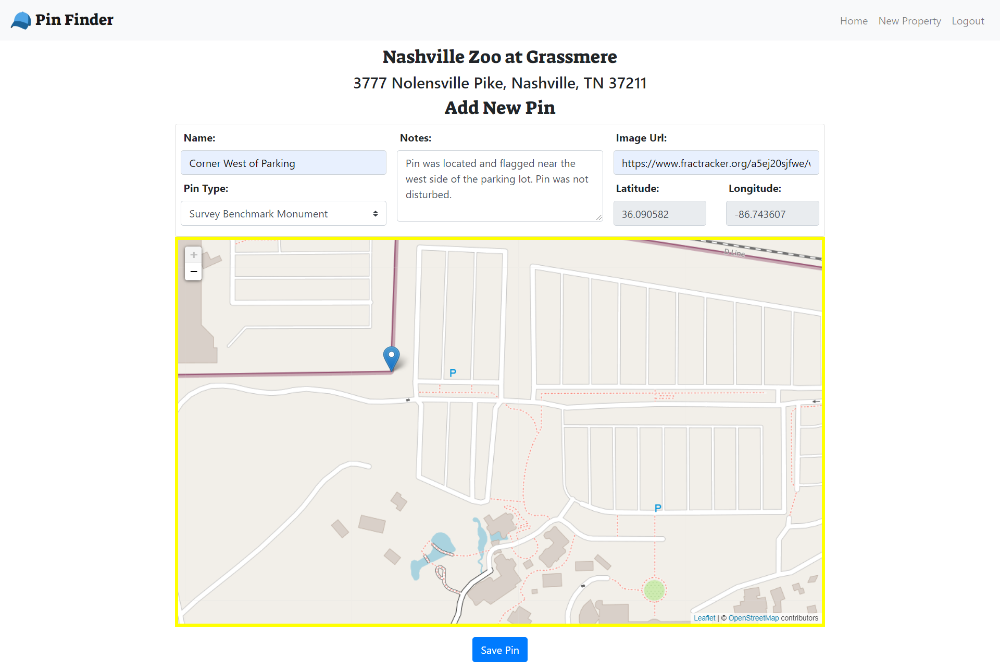
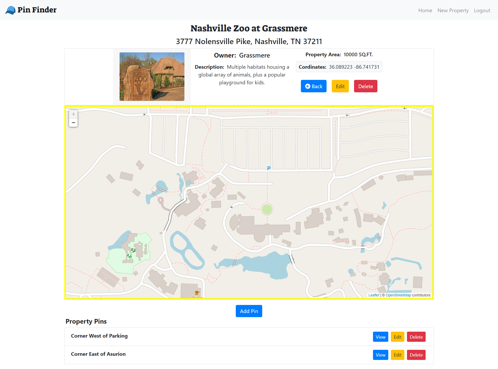
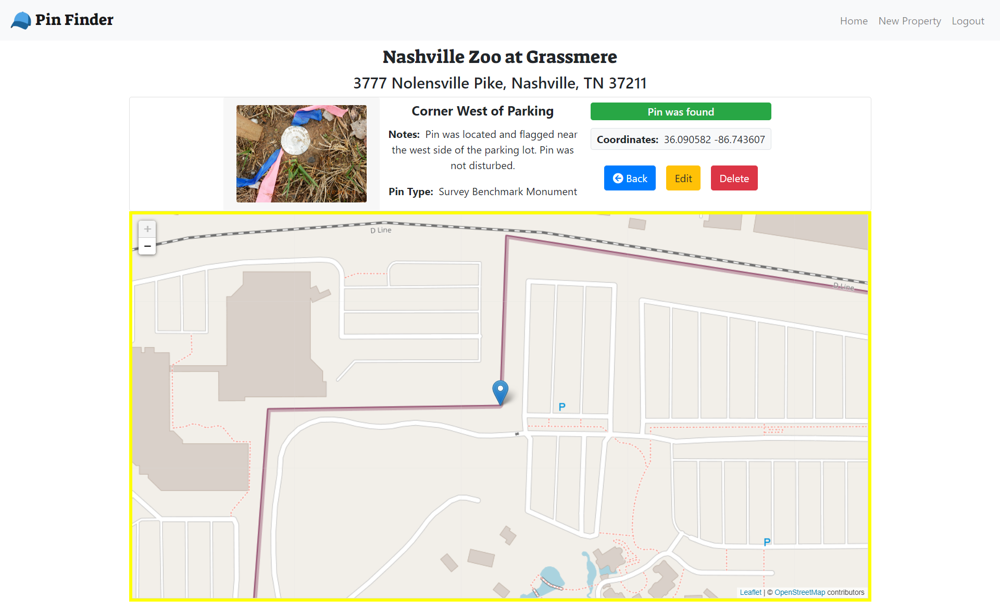
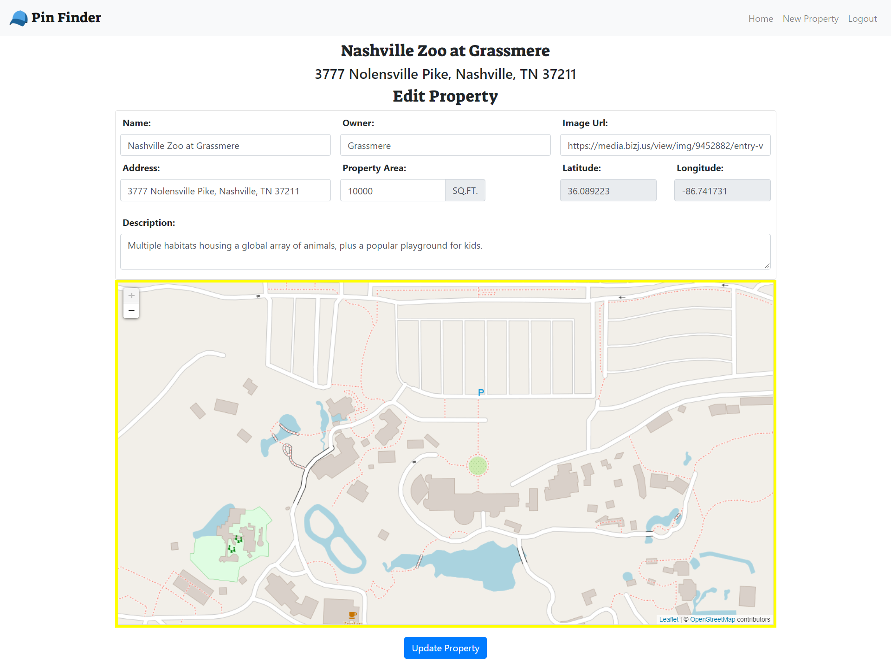
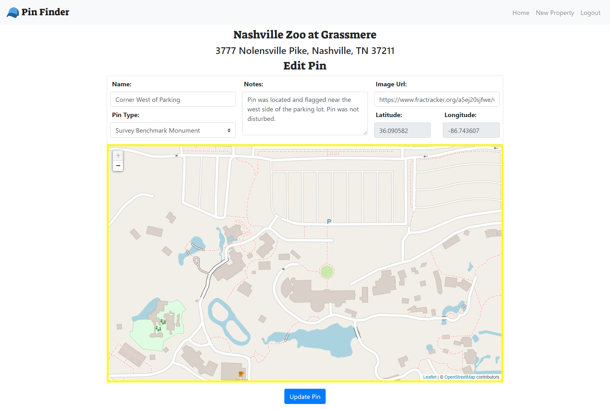
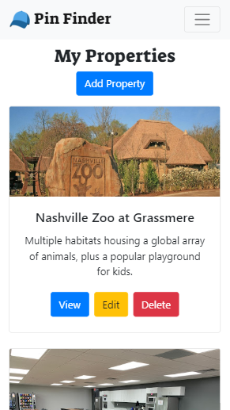

# Pin Finder
## Summary
This was the front end final capstone project that was used to display all the milestones that where throughout the front end side of the full stack development course provided by Nashville Software School. In this project, it was intended that I utilize Google Firebase as a database and Create/Read/Update/Delete that data using React framwork methodology.

The idea of this project was derived from land surveying and the need to find proper monumentation of each property that is surveyed. In some ways this app could provide a short cut in the reconnaissance of these property corners which are also called property pins. Generally the techinicain would need to set up survey equipment in order to pin point a property corner location. This app is in now way try to replicate that process. It's intention is to assist the technicians and make this a more streamlined process. It also creates a history of the property and allows you to save pin locations and provide field notes about the property pins.

## Technology
#### Base Languages
- Vanilla JavaScript
- React
- HTML5
- CSS3

#### Plugins
- Leaflet
- Bootstrap
- Reactstrap
- React DOM
- React Router DOM
- Prop Types
- Google Fonts
- Font Awesome
- Sass

#### Database
- Firebase
- Axios

#### Development Tools
- Chrome DevTools
- Git/GitHub
- Visual Studio Code

## Features
- Create, Read, Update, and Delete your properties
- Create, Read, Update, and Delete pins for each property
- Use Leaflet Map to Create and Update property and pin locations 
- Use Leaflet Map Marker to set a visual location on the map for each pin

## Screenshots
#### Home Page

#### New Property Form

#### New Pin Form

#### Single Property View

#### Single Pin View

#### Edit Property Form

#### Edit Pin Form

#### Responsive Design

## About The Logo

The billed cap is representitive of the field technicians that work in land surveying. In my experience the technicians would always wear a hat to keep the sun off their faces. I wanted to use a logo that was easy to implement and was free to use. That's when I discovered that Twitter's Twemojis are completely open source under the creative commons lisence CC-BY 4.0. This allowed me to save time when branding the app. 

Copyright 2020 Twitter, Inc and other contributors
Code licensed under the MIT License: http://opensource.org/licenses/MIT
Graphics licensed under CC-BY 4.0: https://creativecommons.org/licenses/by/4.0/

## How To Run
1. Clone down this repo
1. Make sure you have  http-serve installed via npm. If not, get it [HERE](https://npmjs.com/package/http-server).
1. On your command line run `hs -p 9999`
1. In your browser go to `http://localhost:9999`

## Contributors
* Joey Petrone - [joeydev.net](https://joeydev.net)
